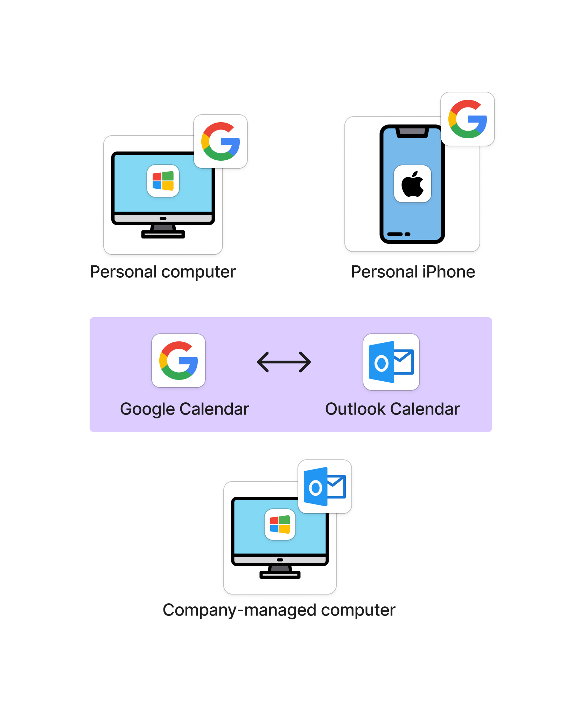

---
layout:	post
title:	"Synchronize Personal and Work calendars"
date:	2025-02-07
---

  
I have two calendars: one is a company-managed Outlook calendar, and the other is a Google calendar for personal work.

I choose Google calendar for personal use because I own an iPhone and a Windows PC, so I need something that works smoothly on both. It is not convenient to use Apple Calendar on a Windows PC. Outlook is great, but I also use Gmail as my primary mailbox. Therefore, Google calendar is my best choice.

  
I can neither access the company-managed Outlook calendar from my personal phone nor my personal computer. However, I want to be able to view all my schedules at any time. Time conflicts are terrible.

  
There are third-party service providers that can combine all calendars into a single one. However, I do not prefer third-party services in this case.

Instead, I found that both Google and Outlook allow me to subscribe to each other’s calendars.

- Subscribe to Google Calendar in Outlook - [https://support.microsoft.com/en-us/office/see-your-google-calendar-in-outlook-c1dab514-0ad4-4811-824a-7d02c5e77126](https://support.microsoft.com/en-us/office/see-your-google-calendar-in-outlook-c1dab514-0ad4-4811-824a-7d02c5e77126)
- Subscribe to Outlook Calendar in Google Calendar - [https://support.google.com/calendar/answer/37100?hl=en&co=GENIE.Platform%3DDesktop&sjid=8918504672457931033-NC](https://support.google.com/calendar/answer/37100?hl=en&co=GENIE.Platform%3DDesktop&sjid=8918504672457931033-NC)

The outcome is that now I have all schedules in both my personal and work calendars and can access them from any device.

  
There is a delay in calendar synchronization — around 24 hours for Google calendar — with no setting to change that - [https://support.google.com/calendar/thread/225477597/increase-calendar-sync-frequency?hl=en](https://support.google.com/calendar/thread/225477597/increase-calendar-sync-frequency?hl=en).

If we want synchronization to happen more frequently, we need additional setup using Google Apps Script - [https://github.com/derekantrican/GAS-ICS-Sync](https://support.google.com/calendar/thread/225477597/increase-calendar-sync-frequency?hl=en).